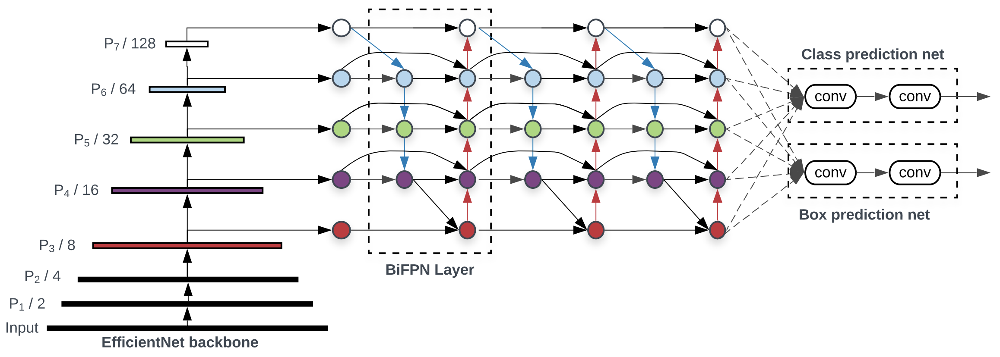
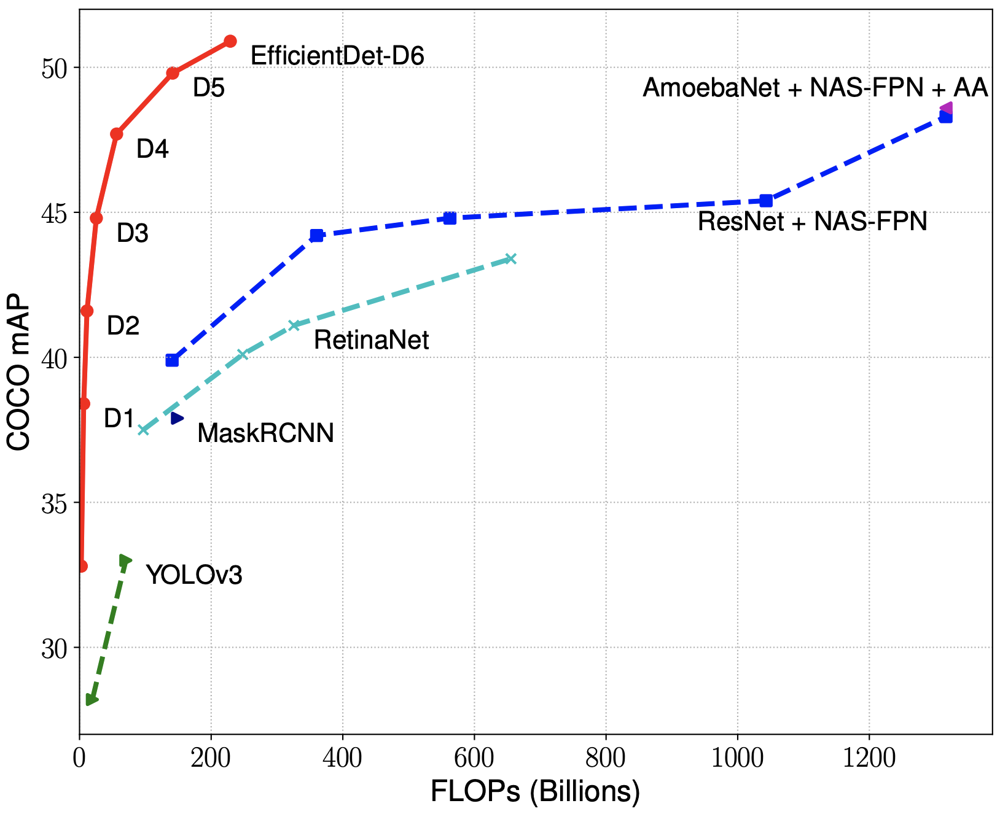
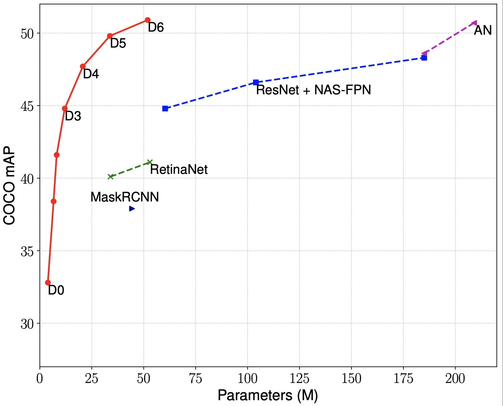

# EfficientDet

[1] Mingxing Tan, Ruoming Pang, Quoc V. Le. EfficientDet: Scalable and Efficient Object Detection. CVPR 2020.
    Arxiv link: https://arxiv.org/abs/1911.09070

Updates:

  - **Apr1: Updated results for test-dev and added EfficientDet-D7 (52.2 AP).**
  - Mar26: Fixed a few bugs and updated all checkpoints/results.
  - Mar24: Added tutorial with visualization and coco eval: [tutorial.ipynb](tutorial.ipynb)
  - Mar 13: Released the initial code and models.

## 1. About EfficientDet Models

EfficientDets are a family of object detection models, which achieve state-of-the-art 52.2mAP on COCO test-dev, yet being 4x - 9x smaller and using 13x - 42x fewer FLOPs than previous detectors. Our models also run 2x - 4x faster on GPU, and 5x - 11x faster on CPU than other detectors.

EfficientDets are developed based on the advanced backbone, a new BiFPN, and a new scaling technique:

  * **Backbone**: we employ [EfficientNets](https://arxiv.org/abs/1905.11946) as our backbone networks.
  * **BiFPN**: we propose BiFPN, a bi-directional feature network enhanced with fast normalization, which enables easy and fast feature fusion.
  * **Scaling**: we use a single compound scaling factor to govern the depth, width, and resolution for all backbone, feature & prediction networks.

Our model family starts from EfficientDet-D0, which has comparable accuracy as [YOLOv3](https://arxiv.org/abs/1804.02767). Then we scale up this baseline model using our compound scaling method to obtain a list of detection models EfficientDet-D1 to D6, with different trade-offs between accuracy and model complexity.

<table border="0">
<tr>
    <td>
    
    </td>
    <td>
    
    </td>
</tr>
</table>

** For simplicity, we compare the whole detectors here. For more comparison on FPN/NAS-FPN/BiFPN, please see Table 4 of our [paper](https://arxiv.org/abs/1911.09070).

## 2. Pretrained EfficientDet Checkpoints

We have provided a list of EfficientDet checkpoints and results as follows:

|       Model    |  APval | APtest    |  AP50 | AP75 |APS   |  APM    |  APL   | | #params | #FLOPs |
|----------     |------ |------ |------ | -------- | ------| ------| ------ |------ |------ |  :------: |
|     EfficientDet-D0 ([ckpt](https://storage.googleapis.com/cloud-tpu-checkpoints/efficientdet/coco/efficientdet-d0.tar.gz), [val](https://storage.googleapis.com/cloud-tpu-checkpoints/efficientdet/coco/val/d0_coco_val.txt), [test-dev](https://storage.googleapis.com/cloud-tpu-checkpoints/efficientdet/coco/testdev/d0_coco_test-dev2017.txt))    | 33.5 | 33.8 | 52.2 | 35.8 | 12.0 | 38.3 | 51.2 |  | 3.9M | 2.54B  |
|     EfficientDet-D1 ([ckpt](https://storage.googleapis.com/cloud-tpu-checkpoints/efficientdet/coco/efficientdet-d1.tar.gz), [val](https://storage.googleapis.com/cloud-tpu-checkpoints/efficientdet/coco/val/d1_coco_val.txt), [test-dev](https://storage.googleapis.com/cloud-tpu-checkpoints/efficientdet/coco/testdev/d1_coco_test-dev2017.txt))    | 39.1  | 39.6 | 58.6 | 42.3 | 17.9 | 44.3 | 56.0 | | 6.6M | 6.10B |
|     EfficientDet-D2 ([ckpt](https://storage.googleapis.com/cloud-tpu-checkpoints/efficientdet/coco/efficientdet-d2.tar.gz), [val](https://storage.googleapis.com/cloud-tpu-checkpoints/efficientdet/coco/val/d2_coco_val.txt), [test-dev](https://storage.googleapis.com/cloud-tpu-checkpoints/efficientdet/coco/testdev/d2_coco_test-dev2017.txt))    | 42.5 | 43.0 | 62.3 | 46.2 | 22.5 | 47.0 | 58.4 | | 8.1M | 11.0B |
|     EfficientDet-D3 ([ckpt](https://storage.googleapis.com/cloud-tpu-checkpoints/efficientdet/coco/efficientdet-d3.tar.gz), [val](https://storage.googleapis.com/cloud-tpu-checkpoints/efficientdet/coco/val/d3_coco_val.txt), [test-dev](https://storage.googleapis.com/cloud-tpu-checkpoints/efficientdet/coco/testdev/d3_coco_test-dev2017.txt))    | 45.9 | 45.8 | 65.0 | 49.3 | 26.6 | 49.4 | 59.8 | | 12.0M | 24.9B |
|     EfficientDet-D4 ([ckpt](https://storage.googleapis.com/cloud-tpu-checkpoints/efficientdet/coco/efficientdet-d4.tar.gz), [val](https://storage.googleapis.com/cloud-tpu-checkpoints/efficientdet/coco/val/d4_coco_val.txt), [test-dev](https://storage.googleapis.com/cloud-tpu-checkpoints/efficientdet/coco/testdev/d4_coco_test-dev2017.txt))    | 49.0 | 49.4 | 69.0 | 53.4 | 30.3 | 53.2 | 63.2 |  | 20.7M | 55.2B |
|     EfficientDet-D5 ([ckpt](https://storage.googleapis.com/cloud-tpu-checkpoints/efficientdet/coco/efficientdet-d5.tar.gz), [val](https://storage.googleapis.com/cloud-tpu-checkpoints/efficientdet/coco/val/d5_coco_val.txt), [test-dev](https://storage.googleapis.com/cloud-tpu-checkpoints/efficientdet/coco/testdev/d5_coco_test-dev2017.txt))    | 50.5 | 50.7 | 70.2 | 54.7 | 33.2 | 53.9 | 63.2 |  | 33.7M | 135.4B |
|     EfficientDet-D6 ([ckpt](https://storage.googleapis.com/cloud-tpu-checkpoints/efficientdet/coco/efficientdet-d6.tar.gz), [val](https://storage.googleapis.com/cloud-tpu-checkpoints/efficientdet/coco/val/d6_coco_val.txt), [test-dev](https://storage.googleapis.com/cloud-tpu-checkpoints/efficientdet/coco/testdev/d6_coco_test-dev2017.txt))    | 51.3 | 51.7 | 71.2 | 56.0 | 34.1 | 55.2 | 64.1 | | 51.9M  |  225.6B  |
|     EfficientDet-D7 ([ckpt](https://storage.googleapis.com/cloud-tpu-checkpoints/efficientdet/coco/efficientdet-d7.tar.gz), [val](https://storage.googleapis.com/cloud-tpu-checkpoints/efficientdet/coco/val/d7_coco_val.txt), [test-dev](https://storage.googleapis.com/cloud-tpu-checkpoints/efficientdet/coco/testdev/d7_coco_test-dev2017.txt))    | 51.8 | 52.2 | 71.4 | 56.3 | 34.8 | 55.5 | 64.6 | | 51.9M  |  324.8B  |

  ** <em>val</em> denotes validation results, <em>test-dev</em> denotes test-dev2017 results. APval is for validation accuracy, all other AP results in the table are for COCO test-dev2017. All accuracy numbers are for single-model single-scale without ensemble or test-time augmentation. All checkpoints are trained with baseline preprocessing (no autoaugmentation).

## 3. Run inference.

    # Download model and testing image.
    !export MODEL=efficientdet-d0
    !export CKPT_PATH=efficientdet-d0
    !wget https://storage.googleapis.com/cloud-tpu-checkpoints/efficientdet/coco/${MODEL}.tar.gz
    !wget https://user-images.githubusercontent.com/11736571/77320690-099af300-6d37-11ea-9d86-24f14dc2d540.png -O img.png
    !tar xf ${MODEL}.tar.gz

    # Run inference.
    !python model_inspect.py --runmode=infer --model_name=$MODEL \
      --input_image_size=1920x1280 --max_boxes_to_draw=100   --min_score_thresh=0.2 \
      --ckpt_path=$CKPT_PATH --input_image=img.png --output_image_dir=/tmp
    # you can visualize the output /tmp/0.jpg

Here is an example of EfficientDet-D0 visualization: more on [tutorial](tutorial.ipynb)

## 4. Using saved model for inference.

You can also export a saved model, and use it to serve image inference.

    # Step 1: export model
    !python model_inspect.py --runmode=saved_model \
      --model_name=efficientdet-d0 --ckpt_path=efficientdet-d0 \
      --input_image_size=1920x1280 --max_boxes_to_draw=100   --min_score_thresh=0.2 \
      --saved_model_dir=/tmp/saved_model

    # Step 2: do inference with saved model.
    !python model_inspect.py --runmode=saved_model_infer \
      --model_name=efficientdet-d0   --ckpt_path=efficientdet-d0 \
      --input_image_size=1920x1280 \
      --max_boxes_to_draw=100   --min_score_thresh=0.2 \
      --line_thickness=4 --saved_model_dir=/tmp/saved_model  \
      --input_image=img.png --output_image_dir=/tmp/
    # you can visualize the output /tmp/0.jpg

## 5. Eval on COCO 2017 val or test-dev.

    // Download coco data.
    !wget http://images.cocodataset.org/zips/val2017.zip
    !wget http://images.cocodataset.org/annotations/annotations_trainval2017.zip
    !unzip val2017.zip
    !unzip annotations_trainval2017.zip

    // convert coco data to tfrecord.
    !mkdir tfrecord
    !PYTHONPATH=".:$PYTHONPATH"  python dataset/create_coco_tfrecord.py \
        --image_dir=val2017 \
        --caption_annotations_file=annotations/captions_val2017.json \
        --output_file_prefix=tfrecord/val \
        --num_shards=32

    // Run eval.
    !python main.py --mode=eval  \
        --model_name=${MODEL}  --model_dir=${CKPT_PATH}  \
        --validation_file_pattern=tfrecord/val*  \
        --val_json_file=annotations/instances_val2017.json  \
        --hparams="use_bfloat16=false" --use_tpu=False

You can also run eval on test-dev set with the following command:

    !wget http://images.cocodataset.org/zips/test2017.zip
    !unzip -q test2017.zip
    !wget http://images.cocodataset.org/annotations/image_info_test2017.zip
    !unzip image_info_test2017.zip

    !mkdir tfrecord
    !PYTHONPATH=".:$PYTHONPATH"  python dataset/create_coco_tfrecord.py \
          --image_dir=test2017 \
          --image_info_file=annotations/image_info_test-dev2017.json \
          --output_file_prefix=tfrecord/testdev \
          --num_shards=32

    # Eval on test-dev: testdev_dir must be set.
    # Also, test-dev has 20288 images rather than val 5000 images.
    !python main.py --mode=eval  \
        --model_name=${MODEL}  --model_dir=${CKPT_PATH}  \
        --validation_file_pattern=tfrecord/testdev*  \
        --testdev_dir='testdev_output' --eval_samples=20288 \
        --hparams="use_bfloat16=false" --use_tpu=False
    # Now you can submit testdev_output/detections_test-dev2017_test_results.json to
    # coco server: https://competitions.codalab.org/competitions/20794#participate

## 6. Train on PASCAL VOC 2012 with backbone ImageNet ckpt.

    # Download and convert pascal data.
    !wget http://host.robots.ox.ac.uk/pascal/VOC/voc2012/VOCtrainval_11-May-2012.tar
    !tar xf VOCtrainval_11-May-2012.tar
    !mkdir tfrecord
    !PYTHONPATH=".:$PYTHONPATH"  python dataset/create_pascal_tfrecord.py  \
        --data_dir=VOCdevkit --year=VOC2012  --output_path=tfrecord/pascal

    # Download backbone checkopints.
    !wget https://storage.googleapis.com/cloud-tpu-checkpoints/efficientnet/ckptsaug/efficientnet-b0.tar.gz
    !tar xf efficientnet-b0.tar.gz 

    !python main.py --mode=train_and_eval \
        --training_file_pattern=tfrecord/pascal*.tfrecord \
        --validation_file_pattern=tfrecord/pascal*.tfrecord \
        --val_json_file=tfrecord/json_pascal.json \
        --model_name=efficientdet-d0 \
        --model_dir=/tmp/efficientdet-d0-scratch  \
        --backbone_ckpt=efficientnet-b0  \
        --train_batch_size=8 \
        --eval_batch_size=8 --eval_samples=512 \
        --num_examples_per_epoch=5717 --num_epochs=1  \
        --hparams="use_bfloat16=false,num_classes=20,moving_average_decay=0" \
        --use_tpu=False

## 7. Finetune on PASCAL VOC 2012 with detector COCO ckpt.
    # Download efficientdet coco checkpoint.
    !wget https://storage.googleapis.com/cloud-tpu-checkpoints/efficientdet/coco/efficientdet-d0.tar.gz
    !tar xf efficientdet-d0.tar.gz

    # Finetune needs to use --ckpt rather than --backbone_ckpt.
    !python main.py --mode=train_and_eval \
        --num_classes=20 \
        --training_file_pattern=tfrecord/pascal*.tfrecord \
        --validation_file_pattern=tfrecord/pascal*.tfrecord \
        --val_json_file=tfrecord/json_pascal.json \
        --model_name=efficientdet-d0 \
        --model_dir=/tmp/efficientdet-d0-scratch  \
        --ckpt=efficientdet-d0  \
        --train_batch_size=8 \
        --eval_batch_size=8 --eval_samples=1024 \
        --num_examples_per_epoch=5717 --num_epochs=1  \
        --hparams="use_bfloat16=false,num_classes=20,moving_average_decay=0" \
        --use_tpu=False

## 8. Training EfficientDets on TPUs.

To train this model on Cloud TPU, you will need:

   * A GCE VM instance with an associated Cloud TPU resource.
   * A GCS bucket to store your training checkpoints (the "model directory").
   * Install latest TensorFlow for both GCE VM and Cloud.

Then train the model:

    !export PYTHONPATH="$PYTHONPATH:/path/to/models"
    !python main.py --tpu=TPU_NAME --training_file_pattern=DATA_DIR/*.tfrecord --model_dir=MODEL_DIR

    # TPU_NAME is the name of the TPU node, the same name that appears when you run gcloud compute tpus list, or ctpu ls.
    # MODEL_DIR is a GCS location (a URL starting with gs:// where both the GCE VM and the associated Cloud TPU have write access.
    # DATA_DIR is a GCS location to which both the GCE VM and associated Cloud TPU have read access.

For more instructions about training on TPUs, please refer to the following tutorials:

  * EfficientNet tutorial: https://cloud.google.com/tpu/docs/tutorials/efficientnet
  * RetinaNet tutorial: https://cloud.google.com/tpu/docs/tutorials/retinanet

NOTE: this is not an official Google product.
