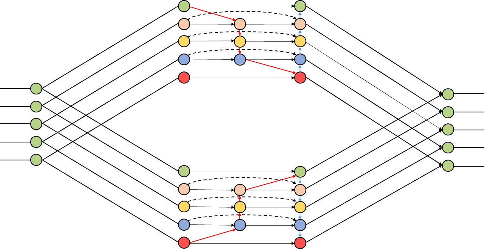

# ExtraDet

This work is heavily based on EfficientDet. We appreciate and thank them for their work. This repository serves merely as a QuadFPN Demo based on EfficientDet.
We call these models ExtraDet in order to avoid clash with the official EfficientDet model (Only difference between the two is usage of QuadFPN instead BiFPN)

[1] Mingxing Tan, Ruoming Pang, Quoc V. Le. EfficientDet: Scalable and Efficient Object Detection. CVPR 2020.
Arxiv link: https://arxiv.org/abs/1911.09070

# QuadFPN Architecture

## 2. Pretrained ExtraDet

We have provided a list of checkpoints and results as follows:

|       Model    |  APval | APtest    |  AP50 | AP75 |APS   |  APM    |  APL   | | #params | #FLOPs |
|----------     |------ |------ |------ | -------- | ------| ------| ------ |------ |------ |  :------: |
|     ExtraDet-X0 ([ckpt](https://drive.google.com/drive/folders/1ly0ewnXLwywVHimargt5SDittTnin_sn?usp=sharing)) | 34.8 | 35.1 | 53.1 | 37.3 | 13.0 | 39.9 | 52.7 |  | 4.13M | 2.76B  |
|     ExtraDet-X1 ([ckpt](https://drive.google.com/drive/folders/1QtWWAalKI-kPJRKGgU1TKUJYz8VWyuyj?usp=sharing)) | 40.3  | 40.8 | 59.3 | 43.7 | 19.5 | 45.6 | 56.6 | | 7.35M | 7.15B |
|     ExtraDet-X2 ([ckpt](https://drive.google.com/drive/folders/14GNLxUhWdI07WM7KEZJ0XeBnc4ul3DV6?usp=sharing)) | 44.0  | 44.2 | 63.0 | 47.6 | 23.9 | 48.8 | 59.2 | | 9.70M | 14.35B |

** <em>val</em> denotes validation results, <em>test-dev</em> denotes test-dev2017 results. APval is for validation accuracy, all other AP results in the table are for COCO test-dev2017. All accuracy numbers are for single-model single-scale without ensemble or test-time augmentation. All checkpoints are trained with baseline preprocessing (no autoaugmentation).

## 3. DEMO

