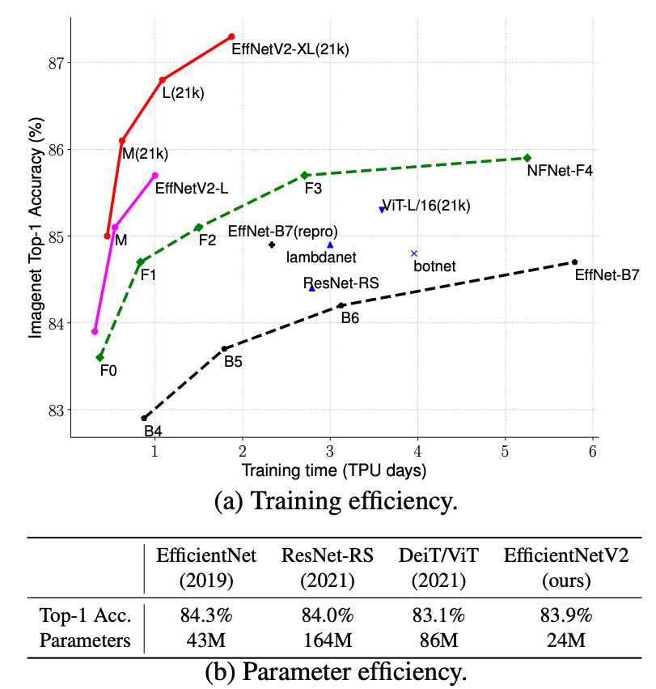
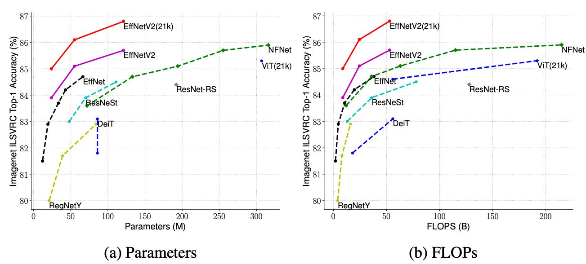

# EfficientNetV2

[Paper](https://arxiv.org/abs/2104.00298)
[Tutorial](https://colab.sandbox.google.com/github/google/automl/blob/master/efficientnetv2/tutorial.ipynb)
[TF-hub](https://colab.sandbox.google.com/github/google/automl/blob/master/efficientnetv2/tfhub.ipynb)

   - Jul19/2021: A list of updates
     * Added TF2 script [here](https://github.com/google/automl/blob/master/efficientnetv2/main_tf2.py).
     * Updated ImageNet21k sigmoid-loss checkpoints, for multi-class pseudo labeling.
     * Add EfficientNetV2-XL 21k and 1k checkpoint and hub modules.
     * Added Nvidia TensorRT script [here](https://github.com/NVIDIA/TensorRT/tree/master/samples/python/efficientnet).
   - May13/2021: Initial code release for [EfficientNetV2 models](https://arxiv.org/abs/2104.00298): accepted to ICML'21.

## 1. About EfficientNetV2 Models

[EfficientNetV2](https://arxiv.org/abs/2104.00298) are a family of image classification models, which achieve better parameter efficiency and faster training speed than prior arts.  Built upon [EfficientNetV1](https://arxiv.org/abs/1905.11946), our EfficientNetV2 models use neural architecture search (NAS) to jointly optimize model size and training speed, and are scaled up in a way for faster training and inference speed.

Here are the comparison on parameters and flops:

## 2. Pretrained EfficientNetV2 Checkpoints

We have provided a list of results and checkpoints as follows:

|      ImageNet1K   |     Top1 Acc.  |    Params   |  FLOPs   | Inference Latency | links  |
|    ----------     |      ------    |    ------   | ------  | ------   |   ------   |
|    EffNetV2-S     |    83.9%   |    21.5M    |  8.4B    | [V100/A100](g3doc/effnetv2-s-gpu.png) |  [ckpt](https://storage.googleapis.com/cloud-tpu-checkpoints/efficientnet/v2/efficientnetv2-s.tgz),  [tensorboard](https://tensorboard.dev/experiment/wozwYcXkRPia76RopgCLlg)
|    EffNetV2-M     |    85.2%   |    54.1M    | 24.7B    | [V100/A100](g3doc/effnetv2-m-gpu.png) |  [ckpt](https://storage.googleapis.com/cloud-tpu-checkpoints/efficientnet/v2/efficientnetv2-m.tgz),  [tensorboard](https://tensorboard.dev/experiment/syoaqB2gTP6Vr0KRlrezmg)
|    EffNetV2-L     |    85.7%   |   119.5M    | 56.3B    | [V100/A100](g3doc/effnetv2-l-gpu.png) |  [ckpt](https://storage.googleapis.com/cloud-tpu-checkpoints/efficientnet/v2/efficientnetv2-l.tgz),  [tensorboard](https://tensorboard.dev/experiment/qgnTQ5JZQ92nSex6ZlWBbQ)

** Thanks NVIDIA for providing the inference latency: full TensorRT scripts and instructions are available here: [link](https://github.com/NVIDIA/TensorRT/tree/master/samples/python/efficientnet)

Here are a list of ImageNet21K pretrained and finetuned models:

|  ImageNet21K  |  Pretrained models |  Finetuned ImageNet1K |
|  ----------   |  ------            |         ------       |
|  EffNetV2-S   |  [pretrain ckpt](https://storage.googleapis.com/cloud-tpu-checkpoints/efficientnet/v2/efficientnetv2-s-21k.tgz)  |  top1=84.9%,  [ckpt](https://storage.googleapis.com/cloud-tpu-checkpoints/efficientnet/v2/efficientnetv2-s-21k-ft1k.tgz),  [tensorboard](https://tensorboard.dev/experiment/7sga2olqTBeH4ioydel0hg/) |
|  EffNetV2-M   |  [pretrain ckpt](https://storage.googleapis.com/cloud-tpu-checkpoints/efficientnet/v2/efficientnetv2-m-21k.tgz)  |  top1=86.2%,  [ckpt](https://storage.googleapis.com/cloud-tpu-checkpoints/efficientnet/v2/efficientnetv2-m-21k-ft1k.tgz),  [tensorboard](https://tensorboard.dev/experiment/HkV6ANZSQ6WI5GhlZa48xQ/) |
|  EffNetV2-L   |  [pretrain ckpt](https://storage.googleapis.com/cloud-tpu-checkpoints/efficientnet/v2/efficientnetv2-l-21k.tgz)  |  top1=86.9%,  [ckpt](https://storage.googleapis.com/cloud-tpu-checkpoints/efficientnet/v2/efficientnetv2-l-21k-ft1k.tgz),  [tensorboard](https://tensorboard.dev/experiment/m9ZHx1L6SQu5iBYhXO5jOw/) |
|  EffNetV2-XL   |  [pretrain ckpt](https://storage.googleapis.com/cloud-tpu-checkpoints/efficientnet/v2/efficientnetv2-xl-21k.tgz)  |  top1=87.2%,  [ckpt](https://storage.googleapis.com/cloud-tpu-checkpoints/efficientnet/v2/efficientnetv2-xl-21k-ft1k.tgz),  [tensorboard]()|

For comparison with EfficientNetV1, we have also provided a few smaller V2 models using the same scaling and preprocessing as V1:

|      ImageNet1K    | Top1 Acc.  |    Params  |  FLOPs   |  links  |
|    ----------      |  ------    |    ------  | ------   |  ------   |
|    EffNetV2-B0     |    78.7%   |    7.1M    | 0.72B    | [ckpt](https://storage.googleapis.com/cloud-tpu-checkpoints/efficientnet/v2/efficientnetv2-b0.tgz),  [tensorboard](https://tensorboard.dev/experiment/BbuZYLXTQXetgnrxXyAyHg/)
|    EffNetV2-B1     |    79.8%   |    8.1M    | 1.2B     | [ckpt](https://storage.googleapis.com/cloud-tpu-checkpoints/efficientnet/v2/efficientnetv2-b1.tgz),  [tensorboard](https://tensorboard.dev/experiment/2xvXQSROTZi674hjfmMXkA)
|    EffNetV2-B2     |    80.5%   |   10.1M    | 1.7B     | [ckpt](https://storage.googleapis.com/cloud-tpu-checkpoints/efficientnet/v2/efficientnetv2-b2.tgz),  [tensorboard](https://tensorboard.dev/experiment/KrdCweUDRoCkREMTJTLvuQ/)
|    EffNetV2-B3     |    82.1%   |   14.4M    | 3.0B     | [ckpt](https://storage.googleapis.com/cloud-tpu-checkpoints/efficientnet/v2/efficientnetv2-b3.tgz),  [tensorboard](https://tensorboard.dev/experiment/0nYo4rMDTQuQcqOFzUMddA/)

Here are the ImageNet21k checkpoints and finetuned models for B0-B3:

* EffNetV2-B0: [ImageNet21k](https://storage.googleapis.com/cloud-tpu-checkpoints/efficientnet/v2/efficientnetv2-b0-21k.tgz), [ImageNet21k-ft1k](https://storage.googleapis.com/cloud-tpu-checkpoints/efficientnet/v2/efficientnetv2-b0-21k-ft1k.tgz)
* EffNetV2-B1: [ImageNet21k](https://storage.googleapis.com/cloud-tpu-checkpoints/efficientnet/v2/efficientnetv2-b1-21k.tgz), [ImageNet21k-ft1k](https://storage.googleapis.com/cloud-tpu-checkpoints/efficientnet/v2/efficientnetv2-b1-21k-ft1k.tgz)
* EffNetV2-B2: [ImageNet21k](https://storage.googleapis.com/cloud-tpu-checkpoints/efficientnet/v2/efficientnetv2-b2-21k.tgz), [ImageNet21k-ft1k](https://storage.googleapis.com/cloud-tpu-checkpoints/efficientnet/v2/efficientnetv2-b2-21k-ft1k.tgz)
* EffNetV2-B3: [ImageNet21k](https://storage.googleapis.com/cloud-tpu-checkpoints/efficientnet/v2/efficientnetv2-b3-21k.tgz), [ImageNet21k-ft1k](https://storage.googleapis.com/cloud-tpu-checkpoints/efficientnet/v2/efficientnetv2-b3-21k-ft1k.tgz)

## 3. Training & Finetuning

Train on ImageNet1k from scratch:

    python main.py --mode=train  --model_name=efficientnetv2-s  --dataset_cfg=imagenet --model_dir=$DIR

Train on ImageNet21k from scratch:

    python main.py --mode=train  --model_name=efficientnetv2-s  --dataset_cfg=imagenet21k --model_dir=$DIR

Finetune on ImageNet from scratch:

    python main.py --mode=train  --model_name=efficientnetv2-s  --dataset_cfg=imagenetFt --model_dir=$DIR --hparam_str="train.ft_init_ckpt=$PRETRAIN_CKPT_PATH"

Finetune on CIFAR10:

    python main.py --mode=train  --model_name=efficientnetv2-s  --dataset_cfg=cifar10Ft --model_dir=$DIR --hparam_str="train.ft_init_ckpt=$PRETRAIN_CKPT_PATH"

## 4. Build a pretrained model and finetuning

You can directly use this code to build a model like this:

    mode = tf.keras.models.Sequential([
        tf.keras.layers.InputLayer(input_shape=[224, 224, 3]),
        effnetv2_model.get_model('efficientnetv2-b0', include_top=False),
        tf.keras.layers.Dropout(rate=0.2),
        tf.keras.layers.Dense(4, activation='softmax'),
    ])

Or you can also load them from tfhub:

    hub_url = 'gs://cloud-tpu-checkpoints/efficientnet/v2/hub/efficientnetv2-b0/feature-vector'
    model = tf.keras.Sequential([
        tf.keras.layers.InputLayer(input_shape=[224, 224, 3]),
        hub.KerasLayer(hub_url, trainable=do_fine_tuning),
        tf.keras.layers.Dropout(rate=0.2),
        tf.keras.layers.Dense(4, activation='softmax'),
    ])

## 5. Inference

    python infer.py --model_name=efficientnetv2-m --model_dir=$MODEL_DIR

A simple example to use EfficientNetV2 model:

    # build keras model
    model = effnetv2_model.EffNetV2Model('efficientnetv2-s')
    # run keras model with inputs [batch, heigh, width, channels]
    endpoints = model(inputs)
    # endpoints[0] is the logits, endpoints[i] is the reduction_level_i

Currently, supported model_name includes: efficientnetv2-s, efficientnetv2-m, efficientnetv2-l, efficientnetv2-b0, efficientnetv2-b1, efficientnetv2-b2, efficientnetv2-b3.  We also support all EfficientNetV1 models including: efficientnet-b0/b1/b2/b3/b4/b5/b6/b7/b8/l2
