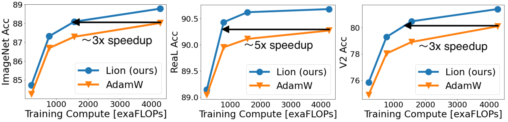

# Symbolic Discovery of Optimization Algorithms

This repository contains PyTorch implementation of the Lion optimizer discovered by AutoML.

## Table of Contents

- [Simple, memory efficient, faster runtime](#simple-memory-efficient-faster-runtime)
- Superior performance on various architectures, tasks, and domains
  - [Image classification](#image-classification)
  - [Vision-language constrastive training](#vision-language-contrastive-training)
  - [Diffusion model](#diffusion-model)
  - [Language modeling](#language-modeling)
- [Hyperparameter and batch size choices](#hyperparameter-and-batch-size-choices)

## Simple, memory efficient, faster runtime

Compared to AdamW and various adaptive optimizers that need to save both first and second moments, Lion only needs the momentum, halving the additional memory footprint. This is beneficial when you need to train large models and / or with a large batch size. As an example, AdamW needs at least 16 TPU V4 chips to train a ViT-B/16 with image size 224 and batch size 4,096, while Lion only needs eight.
Another practical benefit is that Lion has faster runtime (steps / sec) in our experiment due to its simplicity, usually 2-15\% speedup compared to AdamW and Adafactor depending on the task, codebase, and hardware.

## Superior performance on various architectures, tasks, and domains

### **Image classification**

- Lion outperforms AdamW on various architectures trained from scratch on ImageNet or pre-trained on ImageNet-21K.

- Save up to 3-5x pre-training cost on JFT-300M.

- Results after fine-tuned with higher resolution and Polyak averaging.
Our obtained ViT-L/16 matches the previous ViT-H/14 results trained by AdamW while being 2x smaller.
Our ViT-G/14 further achieves a 90.71% accuracy on ImageNet.

### **Vision-language contrastive training**

- On LiT, Lion beats AdamW on zero-shot image classification and image-text retrieval.

- On BASIC-L, Lion achieves new SOTAs on zero-shot and fine-tuning ImageNet accuracy. Note that the 88.3% zero-shot result is 2% higher than the previous SOTA by COCA.

### **Diffusion model**

- Save up to 2.3x compute regarding the FID compared to AdamW (Left to right: 64x64, 128x128, 256x256 image generation trained on ImageNet).

### **Language modeling**

- Save up to 2x compute on the validation perplexity when performing the language modeling task (Left: on Wiki-40B, Right: on PG-19). Lion has larger gain on larger Transformers.

- Achieve better average in-context learning ability on LLMs compared to Adafactor.

- Lion is also better when fine-tuning T5 on GLUE.

## Hyperparameter and batch size choices

- Lion has fewer hyperparamters than AdamW and Adafactor ($\epsilon$ and factorization-related ones).
For a fair comparison, we tune the peak learning rate $lr$ and weight decay $\lambda$ for both AdamW (Adafactor) and our Lion in the logarithmic scale.
By default, $\beta_1=0.9$, $\beta_2=0.999$, $\epsilon=1e-8$ in AdamW, and $\beta_1=0.9$, $\beta_2=0.99$ in Lion as discovered in the search process.
We only tune those hyperparameters in language tasks,
where $\beta_1=0.9$, $\beta_2=0.99$ in AdamW, and $\beta_1=0.95$, $\beta_2=0.98$ in Lion.
Besides, $\epsilon$ in AdamW is set as $1e-6$ (rather than the default $1e-8$) as it improves stability in our experiments similar to RoBERTa.

- The update produced by Lion is an element-wise binary $\pm 1$ due to the sign operation, therefore it has a larger norm than that produced by other optimizers.
Empirically, the suitable $lr$ for Lion is usually 10x smaller than that for AdamW (sometimes 3x smaller $lr$ is a bit better but we recommend setting 10x smaller $lr$ for a quick try).
Since the effective weight decay is $lr\times \lambda$, the $\lambda$ used for Lion is 10x larger than AdamW to maintain a similar strength.
For instance,
  - $lr=1e-4$, $\lambda=10.0$ in Lion and $lr=1e-3$, $\lambda=1.0$ in AdamW when training ViT-B/16 on ImageNet with strong augmentations.
  - $lr=3e-5$, $\lambda=0.1$ in Lion and $lr=3e-4$, $\lambda=0.01$ in AdamW for diffusion models.
  - $lr=1e-4$, $\lambda=0.01$ in Lion and $lr=1e-3$, $\lambda=0.001$ in Adafactor for the 7.5B language modeling.

  Please see our paper for all hyperparameters. 
- Apart from the peak performance, the sensitivity to hyperparameters and the difficulty in tuning them and are also critical for the adoption of an optimizer in practice. In the figure below, we alter both $lr$ and $\lambda$ when training ViT-B/16 from scratch on ImageNet. Suggested by the heatmaps, Lion is more robust to different hyperparameter choices compared to AdamW.

- One may doubt that Lion requires a large batch size to get the accurate direction due to the added noise from the sign operation.
Here we vary the batch size to train a ViT-B/16 on ImageNet (with RandAug and Mixup).
The total training epoch is kept as 300.
As shown in the figure, the optimal batch size for AdamW is 256, while for Lion is 4,096.
So Lion indeed prefers a larger batch size but its performance remains pretty stable.
With a small 64 batch size, Lion still performs on par with AdamW.
When the batch size enlarges to 32K with only 11K training steps,
Lion achieves a significant 2.5\% accuracy gain over AdamW (77.9\% vs. 75.4\%), revealing its effectiveness under the large batch training setting.

Left: Ablation for the effect of batch size. Lion prefers a larger batch than AdamW.
ImageNet accuracy of ViT-B/16 trained from scratch when we vary $lr$ and $\lambda$ for AdamW (Middle) and Lion (Right). Lion is more robust to different hyperparameter choices.
