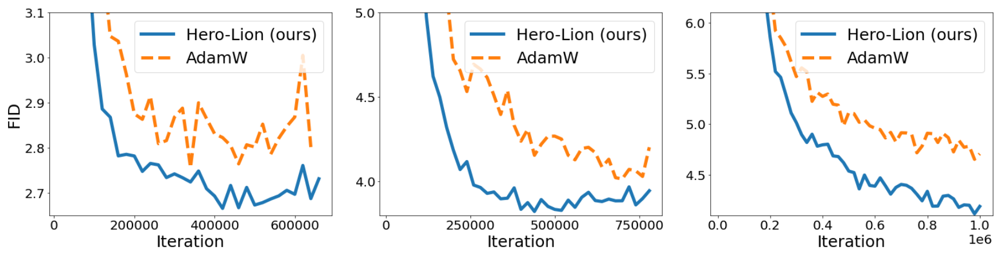

# Symbolic Discovery of Optimization Algorithms

This repository contains JAX, TensorFlow and PyTorch implementations of the Lion optimizer discovered by symbolic program search in the [Symbolic Discovery of Optimization Algorithms](https://arxiv.org/abs/2302.06675) paper. The symbolic program search space (codenamed "Hero") is open sourced at [here](https://github.com/google/automl/tree/master/hero).

<!-- Lion is also successfully deployed in production systems such as Google’s search ads CTR model. -->

Lion is available on multiple codebases, including [Praxis](https://github.com/google/praxis), [Optax](https://github.com/deepmind/optax), [Keras](https://github.com/keras-team/keras/blob/901950201d867c85ec34f4d0c9201aea2c15a65d/keras/optimizers/lion.py), [Timm](https://github.com/huggingface/pytorch-image-models/blob/main/timm/optim/lion.py), [T5X](https://github.com/google-research/t5x/blob/main/t5x/examples/t5/t5_1_1/examples/base_wmt_from_scratch_lion.gin), and a popular [PyTorch implementation by lucidtrains](https://github.com/lucidrains/lion-pytorch).

## Table of Contents

- [Simple, memory efficient, fast runtime](#simple-memory-efficient-fast-runtime)
- Superior performance on various architectures, tasks, and domains
  - [Image classification](#image-classification)
  - [Vision-language contrastive training](#vision-language-contrastive-training)
  - [Diffusion model](#diffusion-model)
  - [Language modeling](#language-modeling)
- [Instructions for hyperparameter tuning and batch size choices](#instructions-for-hyperparameter-tuning-and-batch-size-choices)
- [Citation](#citation)

## Simple, memory efficient, fast runtime

Compared to AdamW and various adaptive optimizers that need to save both first and second moments, Lion only needs the momentum, halving the additional memory footprint. 
This is beneficial when training large models and / or with a large batch size. As an example, AdamW needs at least 16 TPU V4 chips to train a ViT-B/16 with image size 224 and batch size 4,096, while Lion only needs eight.
Another practical benefit is that Lion has faster runtime (steps / sec) in our experiment due to its simplicity, usually 2-15\% speedup compared to AdamW and Adafactor depending on the task, codebase, and hardware.


## Superior performance on various architectures, tasks, and domains

### **Image classification**

- Lion outperforms AdamW on various architectures trained from scratch on ImageNet or pre-trained on ImageNet-21K.


- Lion saves up to 5x the pre-training cost on JFT-300M.


- Results after fine-tuning with higher resolution and Polyak averaging.
Our obtained ViT-L/16 matches the previous ViT-H/14 results trained by AdamW while being 2x smaller.


### **Vision-language contrastive training**

- On LiT, Lion beats AdamW on several zero-shot image classification and image-text retrieval benchmarks.


- On BASIC-L, Lion achieves 88.3% zero-shot and 91.1% fine-tuning ImageNet accuracy, surpassing the previous SOTA results by 2% and 0.1%, respectively.


### **Diffusion model**

- On diffusion models, Lion exceeds AdamW in terms of the FID score and saves up to 2.3x the training compute. Left to right: 64x64, 128x128, 256x256 image generation trained on ImageNet.



### **Language modeling**

- Lion saves up to 2x compute on the validation perplexity when performing the language modeling task (Left: on Wiki-40B, Right: on PG-19). Lion achieves larger gains on larger Transformers.


- Lion achieves better average in-context learning ability when training LMs compared to Adafactor.


- Lion outperforms AdamW when fine-tuning T5 on GLUE.


## Instructions for hyperparameter tuning and batch size choices

- Lion is simple and has fewer hyperparameters compared to AdamW and Adafactor as it does not require $\epsilon$ and factorization-related ones.
To ensure a fair comparison, we tune the peak learning rate $lr$ and decoupled weight decay $\lambda$ for both AdamW (Adafactor) and our Lion using a logarithmic scale.
The default values for $\beta_1$ and $\beta_2$ in AdamW are set as 0.9 and 0.999, respectively, with an $\epsilon$ of $1e-8$, while in Lion, the default values for $\beta_1$ and $\beta_2$ are discovered through the program search process and set as 0.9 and 0.99, respectively.
We only tune those hyperparameters in Section 4.4 of the paper, where $\beta_1=0.9$, $\beta_2=0.99$ in AdamW, and $\beta_1=0.95$, $\beta_2=0.98$ in Lion.
In our experience, reducing $\beta_2$ results in shorter memorization of historical information and `enhanced training stability`.
Additionally, the $\epsilon$ in AdamW is set as $1e-6$ instead of the default $1e-8$ as it improves stability in our experiments, similar to the observations in RoBERTa.

- The update generated by Lion is an element-wise binary $\pm 1$, as a result of the sign operation, therefore it has a larger norm than those generated by other optimizers.
Based on our experience, `a suitable learning rate for Lion is typically 3-10x smaller than that for AdamW.`
Note that the initial value, peak value, and end value of the learning rate should be changed `simultaneously` with the same ratio compared to AdamW.
We `do not` modify other training settings such as the learning rate schedule, gradient and update clipping.
Since the effective weight decay is $lr * \lambda$, `the value of $\lambda$ used for Lion is 3-10x larger than that for AdamW in order to maintain a similar strength.`
For instance, 
    - $lr=1e-4$, $\lambda=10.0$ in Lion and $lr=1e-3$, $\lambda=1.0$ in AdamW when training ViT-B/16 on ImageNet with strong augmentations,
    - $lr=3e-5$, $\lambda=0.1$ in Lion and $lr=3e-4$, $\lambda=0.01$ in AdamW for diffusion models,
    - $lr=1e-4$, $\lambda=0.01$ in Lion and $lr=1e-3$, $\lambda=0.001$ in Adafactor for the 7.5B language modeling. 

  Please see our paper for all hyperparameters.

- Apart from the peak performance, the sensitivity to hyperparameters and the difficulty in tuning them and are also critical for the adoption of an optimizer in practice. In the figure below, we alter both $lr$ and $\lambda$ when training ViT-B/16 from scratch on ImageNet. Suggested by the heatmaps, Lion is more robust to different hyperparameter choices compared to AdamW.

- Some may question whether Lion requires a large batch size to accurately determine the direction due to the added noise from the sign operation. To address this concern, we train a ViT-B/16 model on ImageNet using various batch sizes while maintaining the total training epoch as 300, and incorporating RandAug and Mixup techniques.
As shown in figure below, the optimal batch size for AdamW is 256, while for Lion is 4,096.
This indicates that Lion indeed prefers a larger batch size, but its performance remains robust even with a small 64 batch size.
Furthermore, when the batch size enlarges to 32K, leading to only 11K training steps,
Lion achieves a significant 2.5\% accuracy gain over AdamW (77.9\% vs. 75.4\%), demonstrating its effectiveness in the large batch training setting.


**Left**: Ablation for the effect of batch size. Lion prefers a larger batch than AdamW.
ImageNet accuracy of ViT-B/16 trained from scratch when we vary $lr$ and $\lambda$ for AdamW (**Middle**) and Lion (**Right**). Lion is more robust to different hyperparameter choices.

## Citation

If you find this work helpful, please cite:

```
@misc{chen2023symbolic,
      title={Symbolic Discovery of Optimization Algorithms}, 
      author={Xiangning Chen and Chen Liang and Da Huang and Esteban Real and Kaiyuan Wang and Yao Liu and Hieu Pham and Xuanyi Dong and Thang Luong and Cho-Jui Hsieh and Yifeng Lu and Quoc V. Le},
      year={2023},
      eprint={2302.06675},
      archivePrefix={arXiv},
      primaryClass={cs.LG}
}
```
